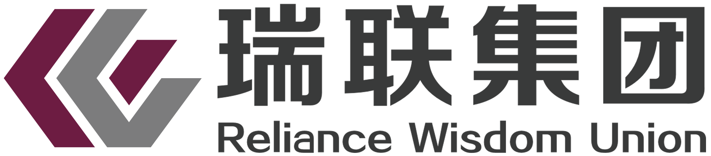

<table>   
 <tr>
        <td></td>
        <td></td>
        <td></td>
        <td></td>
</tr>
</table> 

 
<b><a href="https://www.google.com/search?ei=7VFxX4zYJ5L_wAOtmJKIDg&q=品牌·策划·营销·推广">品牌·策划·营销·推广</a></b> 
 <li>LOGO 字体: <a href="https://reliancehk.github.io/bak//%E7%91%9E%E8%81%94%E7%A7%91%E6%8A%80LOGO/%E6%96%B9%E6%AD%A3%E6%AD%A3%E5%A4%A7%E9%BB%91%E7%AE%80%E4%BD%93.TTF">方正正大黑简体.TTF</a> 字体颜色:黑色  
  ( color=#000000 size=72 face="方正正大黑简体" )
 </li>
 <li>主色：#69012D | RGB:105.1.45 (紫色未经证实)</li>
 <li>辅色：#7C7873 | RGB:124.120.115 (灰色，未经证实) 
&nbsp;&nbsp;&nbsp;&nbsp;&nbsp;&nbsp;&nbsp; #262524 | RGB:38.37.36 (黑色，未经证实)</li>

<table>
    <tr>
     <td><b><li> 品牌发展规划</li></b></td>
     <td><b><li> 品牌市场定位</li></b></td>
     <td><b><li> 品牌分布和品牌影响力</li></b></td>
     <td><b><li> 备注</li></b></td>
    </tr>  
     <tr>
     <td>
      公司形象宣传计划·广告宣传 
      市场策划和品牌推广 
      各类宣传资料、包装、说明书的设计与审定 
      产品的报批工作 
      公共媒介的联络、沟通、维护和信息交流活动 
      </td>
      <td> &nbsp; </td>
      <td>
        
        
       </td> 
      <td> &nbsp </td>
   </tr>  
 </table>
   
  
  
  

 

- 三氢创康 logo： 
  
  采用☞<a href="https://www.3vdown.com/soft/hanbiaogaoqingrui-52537.html" title="【已下载备份到本地】汉标高清锐毛字体免费版-汉标高清锐毛字体下载 -三维下载">汉标高清锐毛字体</a>： 
  <b>汉标高清锐毛</b>是汉标字库推出的一款纯手写书法字体，作者运用大号毛笔精心书写，楷书味道浓厚，由于字体较大，使得笔画清晰度较高，笔画中也减少了过多的处理和笔势，厚重、饱满。因为是纯手写的原因，它独特的气质更与其他字体不同，看似统一，其实各有各的味道，每个字都可以独具风情。字由字在，大到自然，清晰可见便是对它最好的体现。

